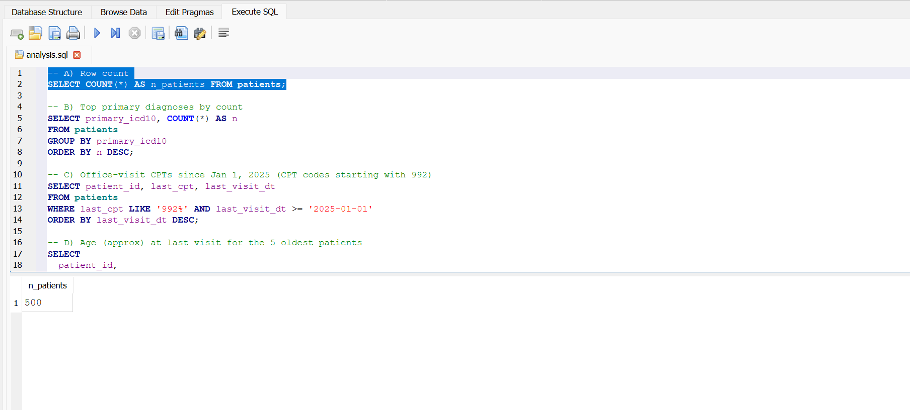
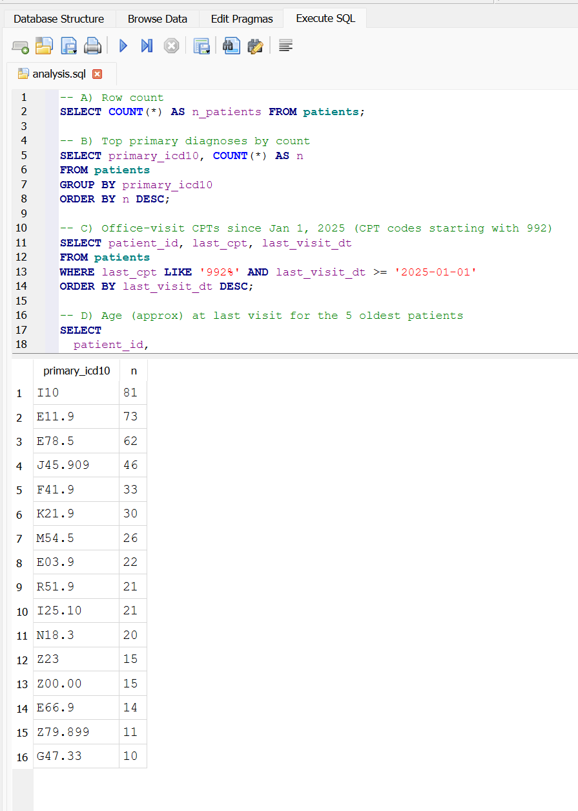
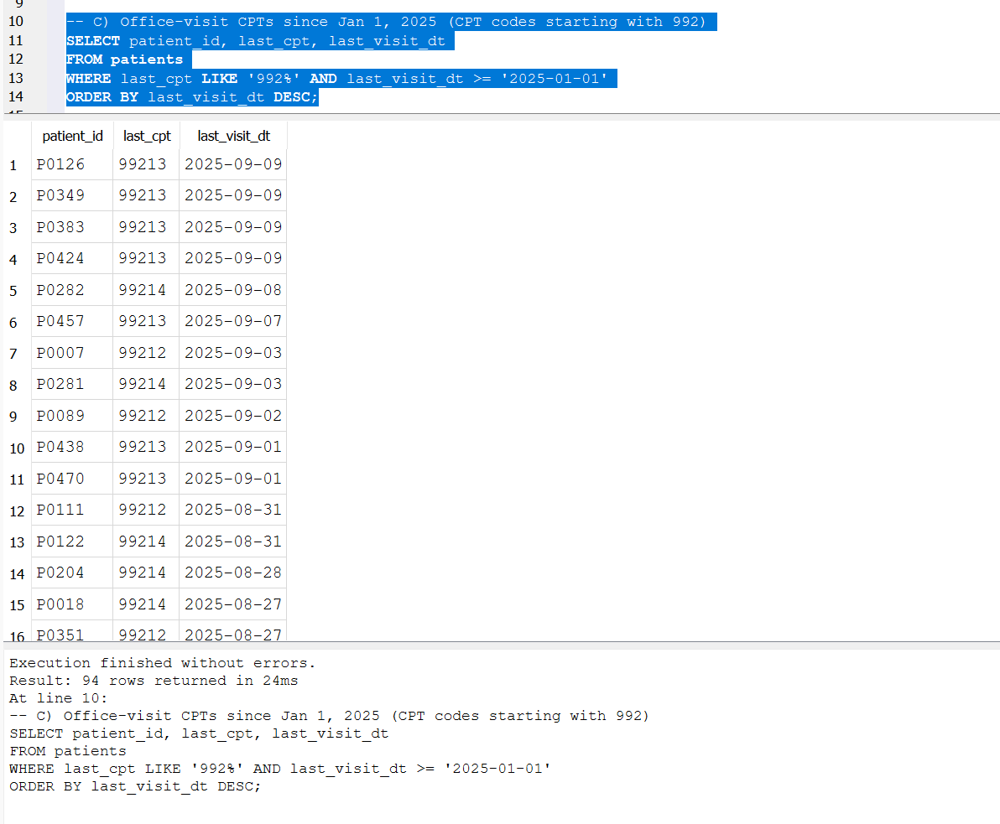
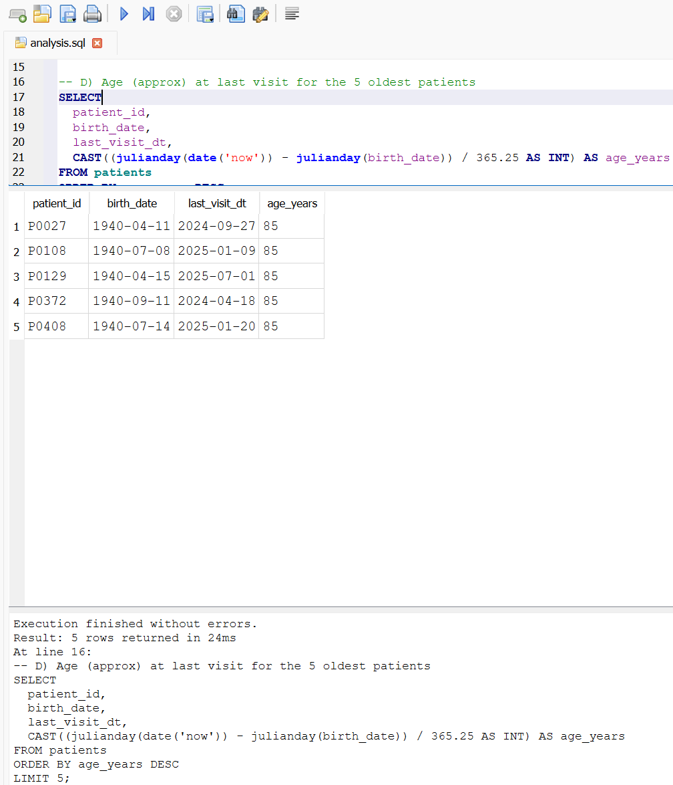
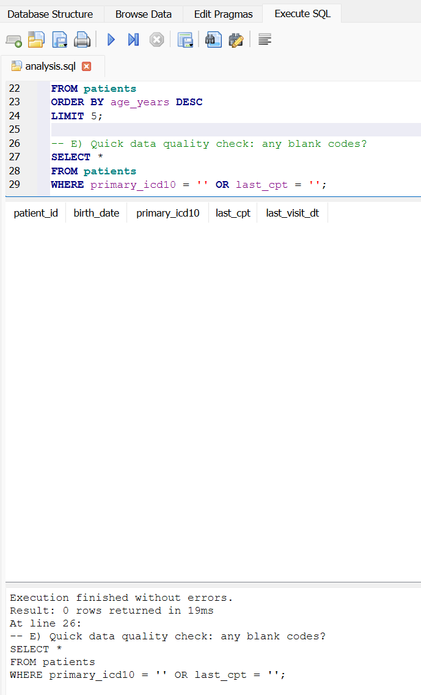

# Assignment 2 (Lite, Split) — Single-Table Patient Roster in SQLite

The purpose of this assignment is to learn how to load patient data from a CSV file using Pandas/SQLAlchemy in SQLite to run simple queries. 

## Run Steps
1. Make sure Python, Pandas, and AQLAlchemy are installed and that the `patients.csv` is in the correct folder. 
2. Run `src/create_db.py` to create `clinic_simple.db` 
3. Run `src/import_csv.py` to load data from `data/patients.csv` into the database.
4. Open `clinic_simple.db` by selecting **Reveal in File Explorer**
5. Select **Open Database** on SQLite and load the `clinic_simple.db` file
6. Then select **Execute SQL** and select the **Open** button to load the `sql.analysis.sql` file 
7. Click the **Execute** button to run the queries line by line to get the results for each section (A-D).
8. Then go to the **Browse Data** and in the **Table** dropdown bar, select `patients`, this will show you our results. 

### Query A: Counts total number of patients in the table
- There are 500 patients in the dataset. 

### Query B: Top primary diagnoses by count
- There were 16 common primary icd10 codes with I10 *(Essential Hypertension)* being the most common.

### Query C: Office-visit CPTs since Jan 1, 2025 (CPT codes starting with 992)
- There were 94 office-visit CPTs since Jan 1, 2025 (CPT codes starting with 992).

### Query D: Age (approx) at last visit for the 5 oldest patients
- This is the age of the 5 oldest patients at their last visit.

### Query E: Quick data quality check: any blank codes?
- There are 0 blank codes. 

